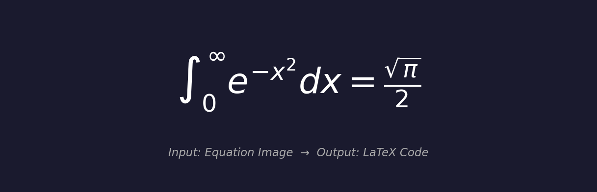
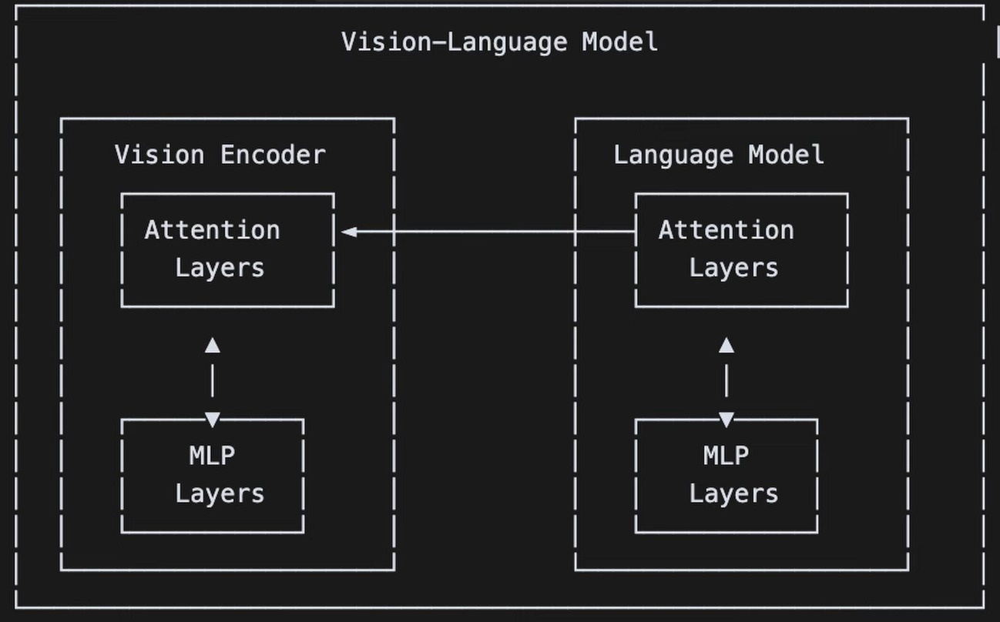
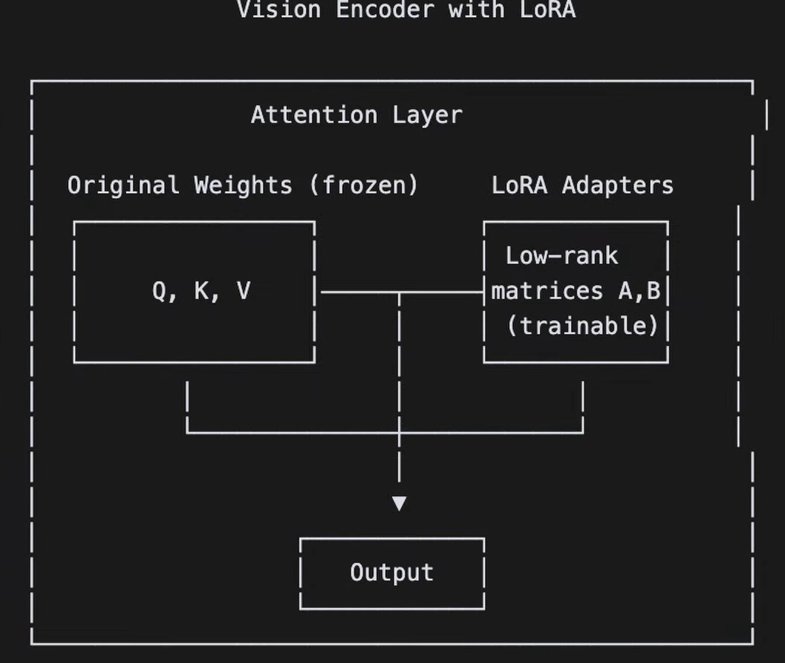
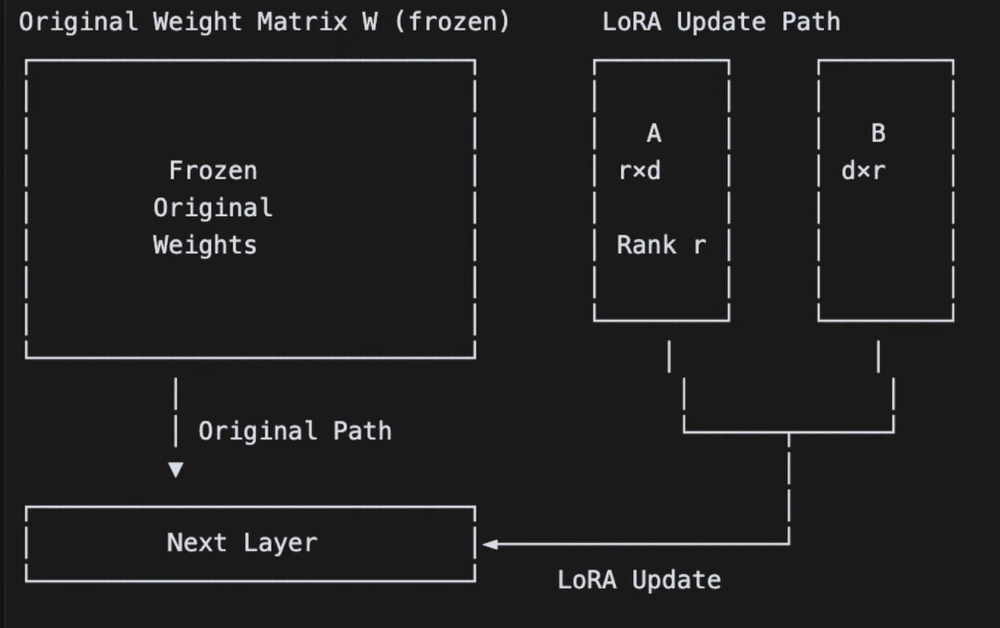

# 🧮 Qwen2-VL → LaTeX OCR Fine-tuning

> Fine-tune **Qwen2-VL-7B** vision-language model to convert images of mathematical equations into LaTeX — using [Unsloth](https://github.com/unslothai/unsloth) for 2x faster training on a free Google Colab T4 GPU.

---

## 📌 What This Project Does

The model takes an **image of a mathematical equation** and outputs the **LaTeX source code** for it.

<p align="center">
  
</p>

**Example output the model generates:**
```latex
\int_0^{\infty} e^{-x^2} dx = \frac{\sqrt{\pi}}{2}
```

This is useful for digitizing handwritten or printed math, converting textbook equations to editable LaTeX, and building math OCR pipelines.

---

## 📁 Project Structure

```
qweneq2latx/
├── diagrams/
│   ├── eq2latx.png
│   ├── vlm.png
│   ├── vlm_lora.png
│   └── lorauppath.png
├── notebooks/
│   ├── 01_setup.ipynb         # Install dependencies & load base model with LoRA
│   ├── 02_dataset.ipynb       # Load, explore & preprocess the LaTeX OCR dataset
│   ├── 03_train.ipynb         # Fine-tune Qwen2-VL using SFTTrainer
│   └── 04_inference.ipynb     # Run inference on new equation images
├── configs/
│   └── train_config.py        # All hyperparameters in one place
├── scripts/
│   └── train.py               # Run training from the command line
├── requirements.txt
├── .gitignore
└── README.md
```

---

## 🏗️ Architecture & Technical Diagrams

---

### 📊 Diagram 1 — Vision-Language Model Overview

<p align="center">
  
</p>

**What this diagram shows:**

The **Qwen2-VL-7B** model is a **Vision-Language Model (VLM)** made of two components working together:

**🔵 Vision Encoder (left):**
- Receives the **input equation image**
- **Attention Layers** — scan the image and decide which pixels/regions matter most (e.g., the integral sign, exponents, fractions)
- **MLP Layers** — transform those visual features into numerical embeddings the language model can read
- The two layers communicate with each other via the upward arrows, refining image understanding

**🟢 Language Model (right):**
- Receives the visual embeddings from the Vision Encoder
- Its own **Attention Layers** attend to both image features AND the text generated so far
- Its own **MLP Layers** process and transform those features
- Generates the **LaTeX output token by token** (e.g., `\int`, `_0`, `^`, `\infty` ...)

**➡️ The arrow between them** represents the cross-attention connection — the Language Model constantly refers back to the Vision Encoder's output while generating each LaTeX token.

> 💡 **Simple analogy:** The Vision Encoder is like your **eyes** reading the equation, and the Language Model is like your **hand** writing the LaTeX. They work together in real time.

---

### 📊 Diagram 2 — Vision Encoder with LoRA

<p align="center">
  
</p>

**What this diagram shows:**

This zooms into **one Attention Layer inside the Vision Encoder** and shows exactly how **LoRA (Low-Rank Adaptation)** plugs in during fine-tuning.

**Inside every Attention Layer, there are 3 weight matrices:**

| Matrix | Full Name | Role |
|---|---|---|
| **Q** | Query | What the model is currently looking for |
| **K** | Key | What information is available in the image |
| **V** | Value | The actual information to extract |

**❌ Without LoRA — Full Fine-tuning:**
- All Q, K, V weights (billions of numbers) get updated
- Requires ~28GB of GPU VRAM — impossible on free Colab
- Extremely slow and expensive

**✅ With LoRA — What we use:**
- The **Original Weights (Q, K, V) are FROZEN** — completely locked, not touched during training
- Two tiny **LoRA Adapter matrices A and B** are added alongside the frozen weights
- Only A and B are trained — they are **thousands of times smaller** than the original weights
- At the **Output**, both paths are merged: `Output = Original(Q,K,V) + LoRA(A,B)`

> 💡 **Simple analogy:** Instead of rewriting an entire 1000-page textbook, you just **attach sticky notes (LoRA)** in the right places. The book stays the same, but the sticky notes add new knowledge.

---

### 📊 Diagram 3 — LoRA Update Path (The Math)

<p align="center">
  
</p>

**What this diagram shows:**

This explains the **mathematical mechanics** of how LoRA updates flow through the network.

**⬛ Left — Original Weight Matrix W (frozen):**
- The large pretrained weight matrix inside the model
- Completely frozen — zero gradients flow through it during training
- Passes output straight down via **Original Path** to the Next Layer

**⬜ Right — LoRA Update Path:**

| Matrix | Shape | Role |
|---|---|---|
| **A** | `r × d` | Compresses input into a low-rank space |
| **B** | `d × r` | Expands it back to the original dimension |

- Where **`r` = LoRA rank = 16** (set in `configs/train_config.py`)
- The LoRA update is: **ΔW = B × A**
- Final output = **Original W output + LoRA update (B × A)**

**Why this is powerful:**

| Method | Trainable Parameters | VRAM Needed |
|---|---|---|
| Full fine-tuning | 7,000,000,000 | ~28GB ❌ |
| LoRA (r=16) | ~4,000,000 | ~6GB ✅ |

> 💡 LoRA reduces trainable parameters by **99.9%** — this is why we can fine-tune a 7B model on a **free Google Colab T4 GPU!**

---

## 🚀 Quick Start — Google Colab

### Step 1 — Clone the repo
```bash
git clone https://github.com/YOUR_USERNAME/qweneq2latx.git
```

### Step 2 — Open in Colab
Go to [colab.research.google.com](https://colab.research.google.com) → upload notebooks from `notebooks/` folder.

### Step 3 — Enable GPU

### Step 4 — Run notebooks in order

| Order | Notebook | What it does |
|---|---|---|
| 1️⃣ | `01_setup.ipynb` | Installs packages, loads Qwen2-VL-7B, applies LoRA |
| 2️⃣ | `02_dataset.ipynb` | Loads LaTeX OCR dataset, formats into conversations |
| 3️⃣ | `03_train.ipynb` | Fine-tunes the model using SFTTrainer |
| 4️⃣ | `04_inference.ipynb` | Tests the fine-tuned model on new images |

---

## 🧠 Model Details

| Property | Value |
|---|---|
| **Base Model** | Qwen2-VL-7B-Instruct |
| **Fine-tuning Method** | LoRA (Low-Rank Adaptation) |
| **Quantization** | 4-bit (bitsandbytes) |
| **Training Framework** | Unsloth + TRL SFTTrainer |
| **Task** | Image → LaTeX OCR |
| **Dataset** | unsloth/Latex_OCR (HuggingFace) |

---

## ⚙️ Configuration

| Parameter | Value | Description |
|---|---|---|
| LoRA rank (r) | 16 | Size of LoRA matrices A and B |
| LoRA alpha | 16 | Scaling factor for LoRA updates |
| Learning rate | 2e-4 | How fast the model learns |
| Batch size | 2 | Images per training step |
| Gradient accumulation | 4 | Effective batch size = 2×4 = 8 |
| Max training steps | 30 | Total number of training steps |
| Optimizer | adamw_8bit | Memory-efficient optimizer |
| Weight decay | 0.01 | Regularization to prevent overfitting |
| Warmup steps | 5 | Steps before full learning rate |
| Max new tokens | 128 | Max LaTeX tokens at inference |

---

## 📦 Installation

```bash
pip install -r requirements.txt
```

---

## 💡 Tips & Troubleshooting

- **Save model to Drive** to avoid losing progress after Colab timeout:
```python
  from google.colab import drive
  drive.mount('/content/drive')
  model.save_pretrained("/content/drive/MyDrive/qweneq2latx/model")
  tokenizer.save_pretrained("/content/drive/MyDrive/qweneq2latx/tokenizer")
```
- **Out of memory**: Set `BATCH_SIZE = 1` in `configs/train_config.py`
- **Better accuracy**: Set `MAX_STEPS = 100+` for longer training

---

## 🙏 Credits

- [Unsloth](https://github.com/unslothai/unsloth) — 2x faster fine-tuning with less memory
- [Qwen2-VL](https://huggingface.co/Qwen/Qwen2-VL-7B-Instruct) — base model by Alibaba
- [LaTeX OCR Dataset](https://huggingface.co/datasets/unsloth/Latex_OCR) — training data
- [TRL](https://github.com/huggingface/trl) — SFTTrainer for supervised fine-tuning

---

## 📄 License

This project is open-source and available under the [MIT License](LICENSE).